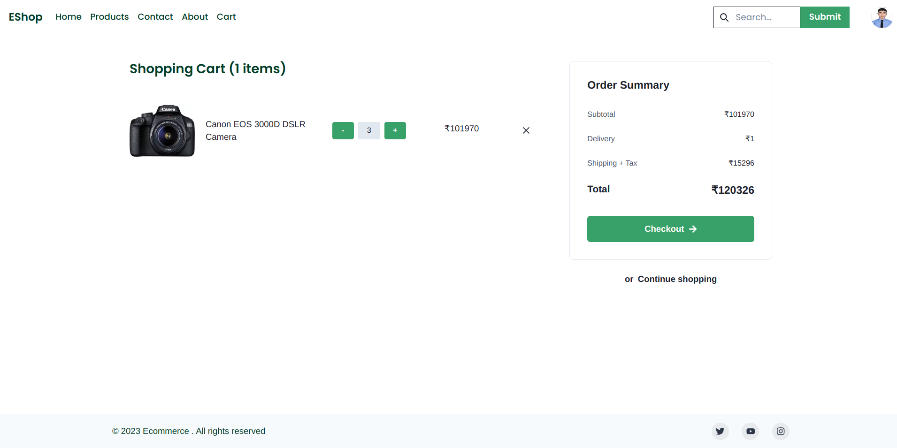
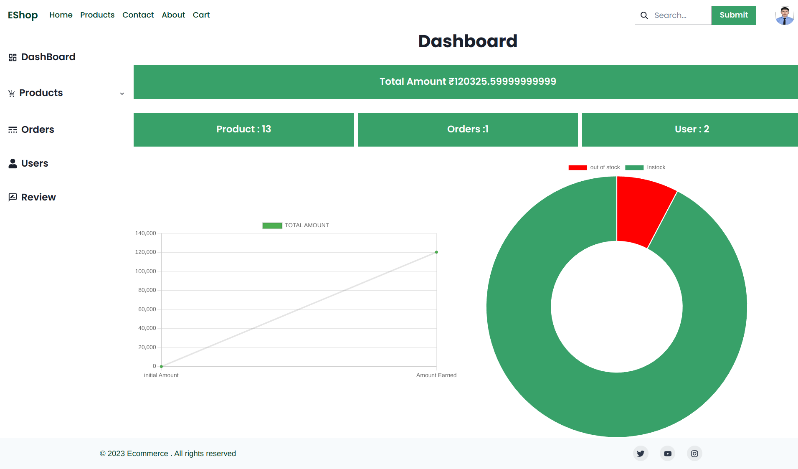

<!DOCTYPE html>
<html lang="en">
<head>
    <meta charset="UTF-8">
    <meta name="viewport" content="width=device-width, initial-scale=1.0">
</head>
<body>
    <h1>MERN E-COMMERCE VivekBoiiCart</h1>
    
Hi! My name is <strong>Vivek Kumar</strong>, and I have created this project to learn MERN Stack.

    <h2>Install Dependencies</h2>
    
<strong>For Backend</strong> - <code>npm i</code>

    
<strong>For Frontend</strong> - <code>cd frontend</code> <code>npm i</code>

    <h2>Env Variables</h2>
    
Make sure to create a <code>config.env</code> file in <code>backend/config</code> directory and add appropriate variables in order to use the app.

    <h3>Essential Variables</h3>
    <ul>
        <li><strong>PORT=</strong></li>
        <li><strong>DB_URI=</strong></li>
        <li><strong>STRIPE_API_KEY=</strong></li>
        <li><strong>STRIPE_SECRET_KEY=</strong></li>
        <li><strong>JWT_SECRET=</strong></li>
        <li><strong>JWT_EXPIRE=</strong></li>
        <li><strong>COOKIE_EXPIRE=</strong></li>
        <li><strong>SMPT_SERVICE=</strong></li>
        <li><strong>SMPT_MAIL=</strong></li>
        <li><strong>SMPT_PASSWORD=</strong></li>
        <li><strong>SMPT_HOST=</strong></li>
        <li><strong>SMPT_PORT=</strong></li>
        <li><strong>CLOUDINARY_NAME=</strong></li>
        <li><strong>CLOUDINARY_API_KEY=</strong></li>
        <li><strong>CLOUDINARY_API_SECRET=</strong></li>
    </ul>
    <h1>E-Commerce Website Features</h1>
    <h2>1. Homepage:</h2>
    <ul>
        <li>Search bar</li>
        <li>Categories listing</li>
    </ul>
    <h2>2. Product Page:</h2>
    <ul>
        <li>Search functionality</li>
        <li>Filters for price, ratings, and categories</li>
        <li>Add to cart button</li>
        <li>Stock availability check</li>
        <li>Pagination for product listing</li>
        <li>Product reviews system</li>
    </ul>
    
        <h2>3. Cart Page:</h2>
    <ul>
        <li>Add, modify, or remove items</li>
        <li>Quantity adjustment</li>
        <li>Total calculated</li>
    </ul>
    <h2>4. Contact Page:</h2>
    <ul>
        <li>Contact form</li>
    </ul>
    <h2>5. Sign Up Page:</h2>
    <ul>
        <li>Avatar upload using Cloudinary</li>
        <li>User registration</li>
    </ul>
    
        <h2>6. Login Page:</h2>
    <ul>
        <li>Forgot password functionality (email sent for password reset)</li>
    </ul>
    <h2>7. Checkout Page:</h2>
    <ul>
        <li>Fill details for order</li>
        <li>Review order</li>
        <li>Stripe payment integration</li>
    </ul>
    
        <h2>8. User Account:</h2>
    <ul>
        <li>Change password</li>
        <li>Update profile</li>
        <li>Order history</li>
    </ul>
    <h2>9. Admin Panel:</h2>
    <ul>
        <li>Dashboard with statistics (users, reviews, orders, total amount)</li>
        <li>Bar graph and pie chart for easy understanding</li>
        <li>Manage products (add, update, delete)</li>
        <li>Modify orders</li>
        <li>User management (change details, delete)</li>
        <li>Review management</li>
    </ul>
    
        <h2>10. Review System:</h2>
    <ul>
        <li>Allow users to leave reviews</li>
        <li>Admin can manage reviews</li>
    </ul>
    
    
Fill each field with your information respectively.

    <h3>Author</h3>
    
<strong>LinkedIn</strong> Click <a href="https://in.linkedin.com/in/vivekboii" target="_blank">Here</a> <strong>@vivekboii</strong>

</body>
</html>
